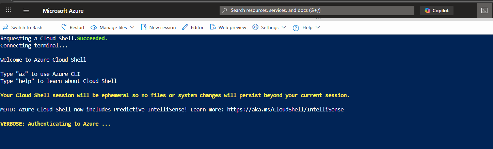

## Plan for Today, Sunday 10a-2p EST
- Getting oriented in our new Azure accounts

TODO:
A staff with VSES $150 monthly Azure credit subscription shall create a subscription filter 'Azure BootUP' that only shows 'Visual Studio Enterprise Subscription - MPN'

- Getting oriented in the Azure Portal
- Lots of Q & A
    - Labs:
        - [Lab 01 - Manage Microsoft Entra ID Identities](https://microsoftlearning.github.io/AZ-104-MicrosoftAzureAdministrator/Instructions/Labs/LAB_01-Manage_Entra_ID_Identities.html) 
        - ***RECOMMEND personal email account tenant, aka PERSONAL tenant ***
        - [Lab 02a - Manage Subscriptions and RBAC](https://microsoftlearning.github.io/AZ-104-MicrosoftAzureAdministrator/Instructions/Labs/LAB_02a_Manage_Subscriptions_and_RBAC_Entra.html) 
        - *** CORRECTION : RECOMMEND PERSONAL tenant ***

---

### After the break:
- Q&A, post any questions for discussion in the Zoom chat 
- Add a Budget to your A VSES tenant
- Add a Cost Anomaly Alert as well
- Discuss and assist with the challenge tasks below
  - Dedicated Admin account in PERSONAL TENANT
  - Add a custom domain to your PERSONAL TENANT

## Challenges (for folks that have done the labs and want more)

### When using Portal to perform tasks in the labs, do the equivalent tasks in AZCLI & PowerShell. 
        > To address security limitations, open Cloud Shell in the personal tenant subscription.
 
        > Save your scripts! Use a private Gitub repo, or where do you prefer to save your scripts.

### Custom Domain
        - Add a custom domain to your PERSONAL TENANT
        

### Dedicated admin account
> It is useful to create a new account in your personal tenant, make it global administrator, and owner of the subscription.

> Logging in with that account rather than your personal email account will simplify things going forward.

  - Use Microsoft Authenticator for that account.
  - TODO: Passwordless after we add Entra P2 trial next week

## TODO
- Note: address A security requirements for screenshot sharing.
- Set up Azure Mobile App, notifications
- Enable Entra P2 trial and demo SSPR
- Policy examples
- Can A admins use mgmt group or admin units to grant some entra permissions over their VSES subscriptions to the students safely?